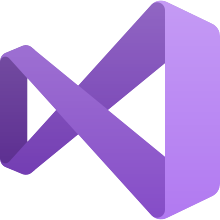

[][knowledge]
[][knowledge]

 

### Hello everyone 👋

My name's David Rojas, a Cross-Platform Developer and Flutter passionate, I'm come from Costa Rica #PuraVida :fire:.

### You can follow me on Linkedin

  
  &#8287;&#8287;&#8287;&#8287;&#8287;

## Technologies I use

[][languages]
[][languages]
[][languages]
[][languages]
[][languages]
[][languages]
[][languages]

 
 

[][database]
[][database]
[][database]
[][database]
[][database]
[][database]

 
 

## Currently Learning

- Ethical Hacking
- Data Science
- Ethereum Smart Contracts

## GitHub Stats

|  |  |
| ------------- | ------------- |

  

[linkedin]: https://linkedin.com/in/jrojasm129
[languages]: #
[database]: #
[knowledge]: #
